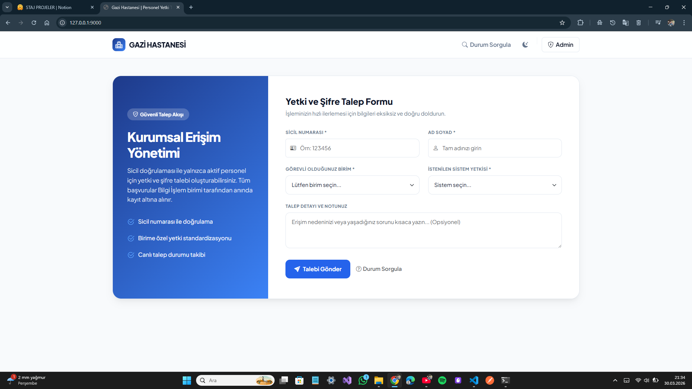
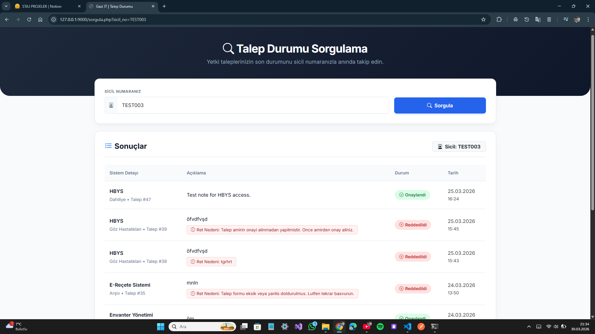
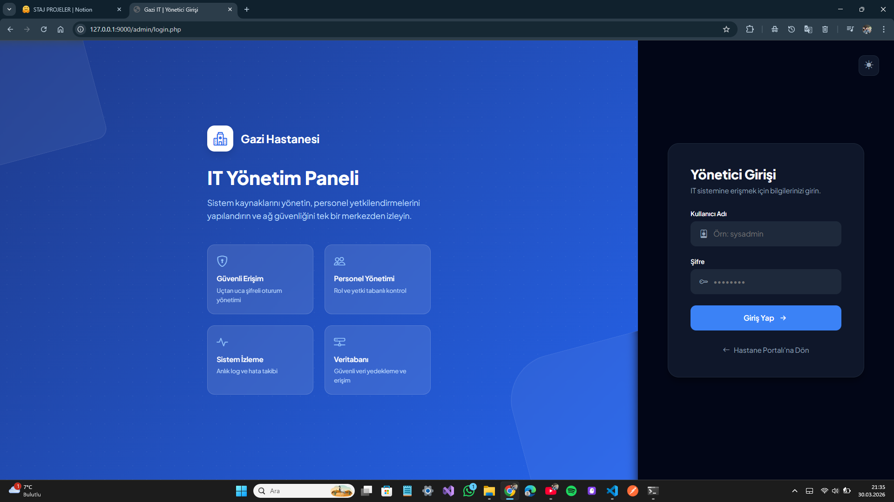
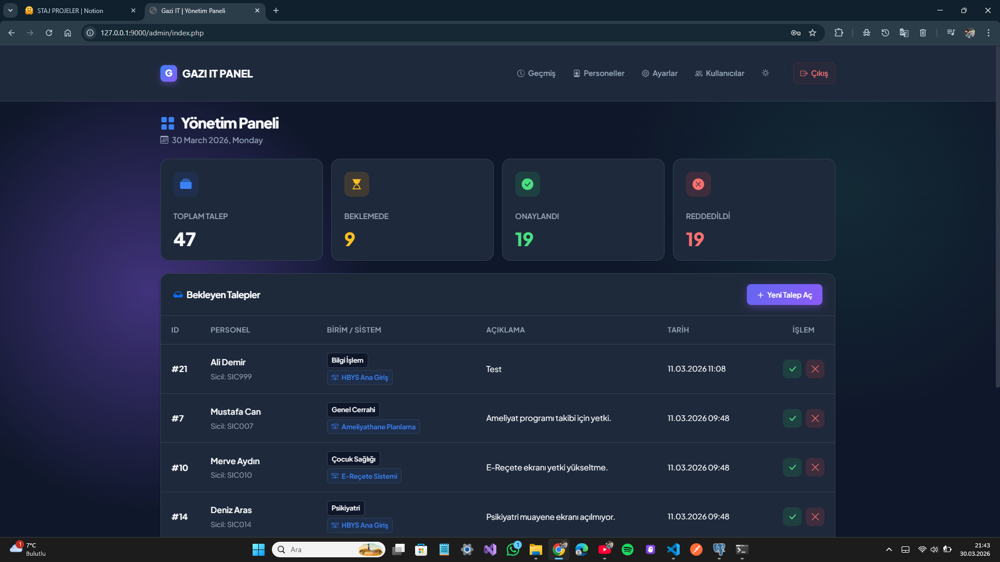
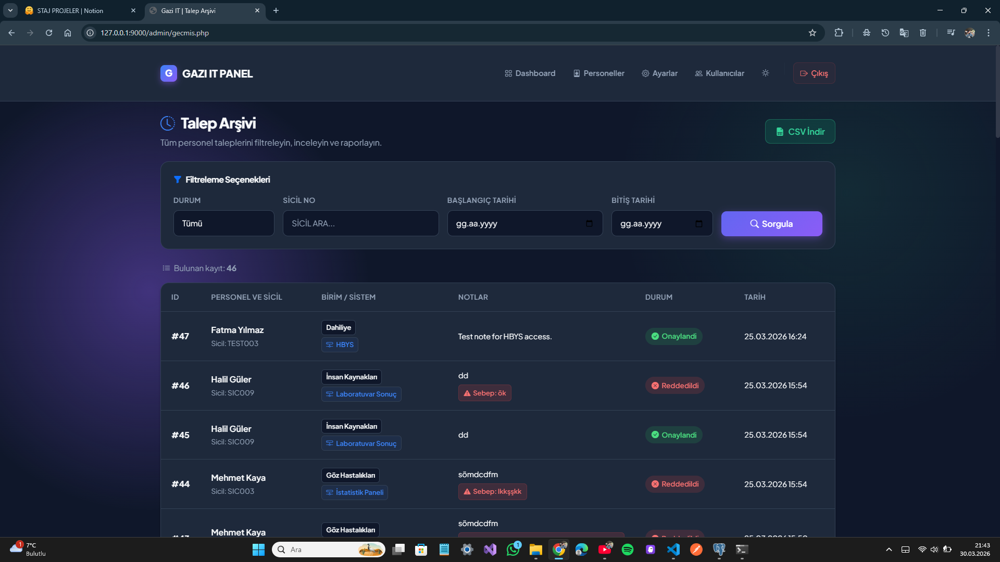
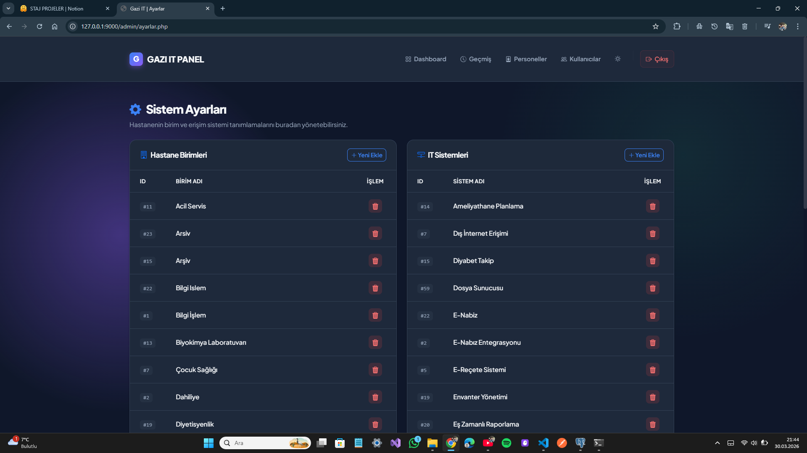

# 👤 Personel Talep Sistemi (PHP + PostgreSQL)

**Modern, Güvenli ve Kullanıcı Dostu Personel Yetki Talep Yönetim Sistemi**

Gazi Üniversitesi ve benzeri kurumlarda çalışan personellerin sistem erişim yetkileri talep etmeleri, yöneticilerin bu talepleri değerlendirmeleri ve onaylaması işlemlerini otomatikleştiren, web tabanlı bir uygulamadır.

---

## 🎯 Proje Nedir?

Bu sistem, **kurumsal bir personel talep yönetim** çözümüdür. Personeller, belirli bir sistem veya birime erişim izni istemek için formu doldururlar. Admin kullanıcılar ise bu talepleri inceleyerek onaylar veya reddederler.

### 🔍 Temel İşleyiş:
1. **Personel** → Talep formu doldurur (sicil numarası ile doğrulama)
2. **Sistem** → Talep veritabanına kaydedilir (durumu: Beklemede)
3. **Admin** → Talepleri dashboard'dan görür
4. **Admin** → Talep onaylar veya ret nedeni ile reddeder
5. **Personel** → Sorgulama sayfasından durumu öğrenebilir

---

## ✨ Temel Özellikler

### 👥 Personel Özellikleri
- ✅ **Talep Formu**: Kolay ve hızlı talep oluşturma
- ✅ **Sicil Doğrulama**: Otomatik sicil numarası kontrolü
- ✅ **Otomatik Form Doldurma**: Sicil girildiğinde ad-soyad ve birim otomatik doldurulur
- ✅ **Talep Sorgulama**: Sicil numarası ile geçmiş ve aktif talepler
- ✅ **Durum Takibi**: Talebin durumunu (Beklemede/Onaylı/Reddedildi) gerçek zamanlı görme
- ✅ **Ret Nedeni**: Reddedilen taleplerde neden bilgisine ulaşma

### 🎛️ Admin Paneli Özellikleri
- ✅ **Dashboard**: İstatistikler ve bekleyen talep özeti
- ✅ **Talep Yönetimi**: Talepleri onaylama/reddetme işlemleri
- ✅ **Gelişmiş Filtreleme**: Durum, sicil, tarih aralığı filtrelemesi
- ✅ **Geçmiş Sayfası**: Tüm talepleri görüntüleme ve raporlama
- ✅ **CSV Export**: Excel'de açılabilir formatta dışa aktarma
- ✅ **Personel Yönetimi**: Personel ekleme, düzenleme, pasif yapma
- ✅ **Birim Yönetimi**: Kurum içi birimleri tanımlama
- ✅ **Sistem Yönetimi**: Erişim talep edilecek sistemleri yönetme
- ✅ **Yetki Seviyeleri**: Farklı admin türleri (Yönetici, Birim Sorumlusu, vb.)
- ✅ **İşlem Takibi**: Hangi admin hangi işlemi yaptığını kaydeder

### 🎨 Tasarım Özellikleri
- ✅ **Responsive Tasarım**: Mobil, tablet, masaüstü uyumlu
- ✅ **Modern UI/UX**: Gradient arka planlar, smooth animasyonlar
- ✅ **Bootstrap Icons**: Zengin ikon seti
- ✅ **Durum Kodlaması**: Renk kodlu durum göstergeleri (sarı/yeşil/kırmızı)
- ✅ **Dark Mode**: Tema seçeneği (açık/koyu tema)

### 🔒 Güvenlik Özellikleri
- ✅ **Session Yönetimi**: Secure session bazlı kimlik doğrulama
- ✅ **Şifre Şifreleme**: password_hash() ile güvenli saklama
- ✅ **SQL Injection Koruması**: Prepared statements kullanımı
- ✅ **XSS Koruması**: HTML encoding ile saldırı önleme
- ✅ **Admin Oturum**: Yetkili girileri ile erişim kontrolü
- ✅ **Audit Log**: İşlem kaydı ve takibi


---

## 📋 Sistem Gereksinimleri

- **PHP**: 7.4+
- **PostgreSQL**: 10+
- **Web Sunucusu**: Apache, Nginx veya PHP built-in server
- **İşletim Sistemi**: Windows, Linux, macOS

---

## 🚀 Kurulum

### Windows - Otomatik Kurulum (En Hızlı Yöntem)

```bash
setup.bat
```

Bu script otomatik olarak:
- PostgreSQL bağlantısını test eder
- Veritabanını oluşturur (`personel_talep`)
- Tabloları ve şemaları yükler
- Örnek veriler ekler
- Admin kullanıcısını tanımlar
- Sistem kontrolü yapar

### Manuel Kurulum Adımları

#### Adım 1: PostgreSQL Veritabanı Kurulumu

PowerShell veya Command Prompt'ta açın:

```bash
# PostgreSQL'e bağlan
"C:\Program Files\PostgreSQL\14\bin\psql.exe" -h 127.0.0.1 -U postgres -f database/schema.sql
```

Veya psql terminal'inde:
```sql
psql -U postgres
# Şifre: 1123 (varsayılan)
\i database/schema.sql
```

#### Adım 2: PHP Ayarları

`config/db.php` dosyasındaki veritabanı parametrelerini kontrol edin:
```php
$host = '127.0.0.1';      // PostgreSQL host
$port = '5432';             // Port (varsayılan)
$dbname = 'personel_talep'; // Veritabanı adı
$user = 'postgres';         // Kullanıcı
$password = '1123';         // Şifre
```

#### Adım 3: PHP Sunucusunu Başlat

```bash
# Hızlı Başlatma (start.bat kullan)
start.bat

# Veya manuel olarak
php -S 127.0.0.1:9000 -t .
```

#### Adım 4: Tarayıcıda Açın

```
http://127.0.0.1:9000
```

---

## 📱 Sayfa Açıklamaları

### 🏠 **PERSONEL SAYFALARı**

#### 1️⃣ **Ana Sayfa (Talep Formu)** 
**URL**: `http://127.0.0.1:9000/index.php`

**Amaç**: Personellerin yetki talep etmeleri için ana giriş noktası

**Özellikler**:
- 📝 **Sicil No Alanı**: Personel sicil numarasını girer
- 🔍 **Otomatik Doğrulama**: Sicil doğrulandıktan sonra ad-soyad ve birim otomatik doldurulur
- 👤 **Ad Soyad**: Sicilden otomatik alınan ve salt okunur alan
- 🏢 **Birim**: Personelin bulunduğu birim (sicilden alınır)
- 💼 **Sistem Seçimi**: Yetki talep edilecek sistemi seçme (dropdown)
- 📄 **Talep Notu**: Neden yetki istediğini belirtme (opsiyonel)
- ✅ **Gönder Butonu**: Talep form'unu gönderme

**Tasarım**:
- 🎨 Gradient arka plan (mavi/yeşil)
- 📱 Mobil uyumlu responsive form
- ✨ Smooth animasyonlar



---

#### 2️⃣ **Talep Sorgulama Sayfası**
**URL**: `http://127.0.0.1:9000/sorgula.php`

**Amaç**: Personellerin geçmiş ve aktif taleplerinî sorgulaması

**Özellikler**:
- 🔍 **Sicil Araması**: Sicil numarası ile taleap arama
- 📊 **Talep Listesi**: Tüm talepleri tarih sırasına göre gösterir
- 🟡 **Durum Göstergeleri**:
  - 🟡 **Beklemede** (Sarı) - İnceleme aşamasında
  - 🟢 **Onaylı** (Yeşil) - Yetki verildi
  - 🔴 **Reddedildi** (Kırmızı) - Talep reddedildi
- 📝 **Ret Nedeni**: Reddedilen taleplerde neden gösterilir
- 📅 **Tarih Bilgisi**: Talep oluşturulma ve işlem tarihleri
- 👤 **Hangi Admin İşlem Yaptı**: İşlemi yapan admin adı

**Tasarım**:
- 📱 Tablo halinde düzenlenmiş liste
- 🎯 Filtreleme ve arama özellikleri
- ✨ Durum rengine göre görsel ayrım



---

### 🔐 **ADMIN SAYFALARı**

#### 🔓 **Admin Girişi**
**URL**: `http://127.0.0.1:9000/admin/login.php`

**Amaç**: İdari personelin sisteme giriş yapması

**Özellikler**:
- 👤 **Kullanıcı Adı**: Admin kullanıcı adı
- 🔑 **Şifre**: Güvenli şifre girdisi
- ✅ **Giriş Butonu**: Sisteme giriş
- ⚠️ **Hata Mesajları**: Hatalı giriş bilgisinde uyarı

**Varsayılan Kullanıcı**:
```
Kullanıcı Adı: admin
Şifre: 1123
```

**Tasarım**:
- 🎨 Clean ve minimal tasarım
- 📱 Mobil uyumlu



---

#### 📊 **Admin Dashboard (Ana Sayfa)**
**URL**: `http://127.0.0.1:9000/admin/index.php`

**Amaç**: Talep yönetiminin merkez kontrol paneli

**Özellikler**:

**📈 İstatistik Kartları** (Üst bölüm):
- 📌 **Toplam Talep Sayısı**: Sisteme kaydedilen tüm talep
- ⏳ **Bekleyen Talep Sayısı**: İnceleme bekleyen talep sayısı
- ✅ **Onaylanan Talep Sayısı**: İşlemi tamamlanan onaylı talep
- ❌ **Reddedilen Talep Sayısı**: Ret edilen talep sayısı

**🔄 Bekleyen Talepler Listesi** (Ortadaki tablo):
- Personel sicil numarası
- Ad-soyad
- Talep edilen sistem
- Birim
- Talep oluşturulma tarihi
- 🎯 **Hızlı İşlem Butonları**:
  - ✅ **Onay**: Talep onaylama
  - ❌ **Red**: Talep reddetme (ret nedeni ile)

**🔗 Navigasyon Menüsü** (Sol veya üst):
- 📊 Dashboard (aktif)
- ✏️ Talep Yönetimi
- 📜 Geçmiş
- 👥 Personel Yönetimi
- 🏢 Birim Yönetimi
- 💼 Sistem Yönetimi
- ⚙️ Ayarlar
- 🚪 Çıkış

**Tasarım**:
- 🎨 Card tabanlı modern tasarım
- 📊 İstatistikleri görsel kartlarla sunum
- ✨ Hover efektleri



---

#### ✏️ **Talep Yönetimi Sayfası**
**URL**: `http://127.0.0.1:9000/admin/islem.php`

**Amaç**: Bekleyen ve işlem bekleyen talepler üzerinde işlem yapma

**Özellikler**:
- 📝 **Talep Detayı**: Talebin tüm bilgileri
- 🎯 **Onaylama İşlemi ve Dialog**:
  - Personel adı gösterimi
  - Uyarı mesajı
  - ✅ Onay / ❌ İptal butonları
- 🎯 **Reddetme İşlemi ve Dialog**:
  - Ret nedeni zorunlu alanı (textarea)
  - Detaylı açıklamalar
  - 📝 Neden girdikten sonra işlem
  - ❌ Red / ❌ İptal butonları
- 🔄 **Modal Animasyonları**: Smooth açılış/kapanış

**Tasarım**:
- 📱 Detaylı talep kartı
- 🎨 Renk kodlu butonlar (yeşil onay, kırmızı red)
- ✨ Backdrop blur ile modal tasarım


---

#### 📜 **Geçmiş ve Raporlama Sayfası**
**URL**: `http://127.0.0.1:9000/admin/gecmis.php`

**Amaç**: Tüm talepleri görmek, filtrelemek ve raporlama yapmak

**Özellikler**:

**🔍 Filtreleme Seçenekleri**:
- 🔎 **Sicil Numarası Arama**: Personel sicili ile talep bulma
- 🟡 **Durum Filtresi**: Beklemede / Onaylı / Reddedildi
- 📅 **Tarih Aralığı**: Başlangıç ve bitiş tarihi seçimi
- 🔄 **Filtre Temizleme**: Bütün filtreleri sıfırla

**📊 Talep Tablosu**:
- Sicil No, Ad Soyad
- Talep edilen Sistem
- Birim adı
- Talep tarihi
- Durum (renk kodlu)
- İşlem tarihi
- Hangi admin işlem yaptığı
- Red nedeni (reddedilmişse)

**💾 Export Seçenekleri**:
- 📥 **CSV Export**: Excel'de açılabilir format
- 🖨️ **Yazdırma**: Sayfayı yazdırma

**📄 Sayfalama**:
- Sayfa başına sonuç sayısı
- Önceki/Sonraki sayfalar
- Toplam sonuç gösterimi

**Tasarım**:
- 🎯 Kompakt ve etkili tablo
- 🔍 Arama ve filtreleme araç çubuğu
- 📊 Export seçenekleri

---

#### 👥 **Personel Yönetimi Sayfası**
**URL**: `http://127.0.0.1:9000/admin/personeller.php`

**Amaç**: Kurumdaki personel verilerini yönetmek

**Özellikler**:

**➕ Personel Ekleme**:
- Modal form ile hızlı ekleme
- Sicil No (otomatik büyük harf)
- Ad Soyad (zorunlu)
- Birim (dropdown seçimi)
- Email (opsiyonel)
- Telefon (opsiyonel)

**📝 Personel Düzenleme**:
- Tüm alanları güncelleme
- Sicil numarası değişikliği
- Birim transfer

**🔄 Durum Yönetimi**:
- Aktif personel talep oluşturabilir
- Pasif personel talep oluşturamaz
- Durum toggle (Aktif/Pasif)

**🔍 Filtreleme**:
- Sicil numarası arama
- Birime göre filtreleme
- Duruma göre filtreleme (Aktif/Pasif)

**📊 Personel Listesi**:
- Sicil, Ad-Soyad, Birim, Email, Telefon
- Durum göstergesi (Aktif/Pasif)
- Kayıt tarihi
- 🎯 İşlem butonları (Düzenle, Sil, Durum Değiştir)

**Tasarım**:
- 🎨 Tablo halinde liste
- ➕ Hızlı ekleme butonu
- ✨ Modal form


---

#### 🏢 **Birim Yönetimi Sayfası**
**URL**: `http://127.0.0.1:9000/admin/` (Ayarlar kısmında)

**Amaç**: Kurumdaki birimleri tanımlama ve yönetme

**Özellikler**:
- ➕ **Yeni Birim Ekleme**: Modal form ile
- 📋 **Birim Listesi**: Tüm birimleri gösterme
- ✏️ **Düzenleme**: Birim adını değiştirme
- ❌ **Silme**: Birim silme (onay ile)
- 🔍 **Birim Sayısı**: Aktif birim sayısı gösterimi


---

#### 💼 **Sistem Yönetimi Sayfası**
**URL**: `http://127.0.0.1:9000/admin/` (Ayarlar kısmında)

**Amaç**: Erişim talep edilebilecek sistemleri tanımlama

**Özellikler**:
- ➕ **Yeni Sistem Ekleme**
- 📋 **Sistem Listesi**: Tüm sistemler
- ✏️ **Düzenleme**: Sistem bilgileri
- ❌ **Silme**: Sistem silme
- 🔢 **Talep Sayacı**: Her sistemin kaç talep aldığı


---

#### ⚙️ **Ayarlar Sayfası**
**URL**: `http://127.0.0.1:9000/admin/ayarlar.php`

**Amaç**: Sistem genelinde ayarları yönetmek

**Özellikler**:
- 👤 **Admin Kullanıcı Yönetimi**: Yönetici ekleme/düzenleme
- 🔐 **Şifre Değiştirme**: Kendi şifresi değiştir
- 🏢 **Birim Yönetimi**: Birim ekleme/düzenleme
- 💼 **Sistem Yönetimi**: Sistem ekleme/düzenleme
- ⚙️ **Sistem Ayarları**: E-mail, bildirim ayarları (gelecek)



---

## 🗄️ Veritabanı Yapısı

### Ana Tablolar

#### 1. **talepler** (Talep Kayıtları)
```
id              INT PRIMARY KEY (Talep ID)
sicil_no        VARCHAR (Personel sicil numarası)
ad_soyad        VARCHAR (Personel adı-soyadı)
birim_id        INT FK (Hangi birim)
sistem_id       INT FK (Hangi sistem talep ediliyor)
talep_notu      TEXT (Talep açıklaması)
durum           VARCHAR (beklemede/onaylandi/reddedildi)
olusturulma_tarihi TIMESTAMP (Talep oluşturulma tarihi)
isleyen_admin_id INT FK (Hangi admin işlem yaptı)
islem_tarihi    TIMESTAMP (İşlem yapılan tarih)
red_neden       TEXT (Reddedilmişse neden)
```

#### 2. **personeller** (Personel Verileri)
```
id              INT PRIMARY KEY
sicil_no        VARCHAR UNIQUE (Sicil numarası)
ad_soyad        VARCHAR (Adı soyadı)
birim_id        INT FK (Birim)
email           VARCHAR (Email adresi)
telefon         VARCHAR (Telefon numarası)
aktif           BOOLEAN (Talep oluşturabiliyor mu?)
kayit_tarihi    TIMESTAMP (Kaydediliş tarihi)
```

#### 3. **birimler** (Birim Listesi)
```
id              INT PRIMARY KEY
birim_adi       VARCHAR UNIQUE (Birim adı)
aciklama        TEXT (Birim açıklaması)
olusturulma_tarihi TIMESTAMP
```

#### 4. **sistemler** (Erişim Sistemleri)
```
id              INT PRIMARY KEY
sistem_adi      VARCHAR UNIQUE (Sistem adı)
aciklama        TEXT (Sistem açıklaması)
olusturulma_tarihi TIMESTAMP
```

#### 5. **admin_kullanicilar** (Admin Kullanıcıları)
```
id              INT PRIMARY KEY
kullanici_adi   VARCHAR UNIQUE (Admin kullanıcı adı)
sifre           VARCHAR (Şifre hash)
ad_soyad        VARCHAR (Adı soyadı)
email           VARCHAR (Email)
yetki_seviyesi  INT (1=Kullanıcı, 2=Birim Sorumlusu, 3=Yönetici)
aktif           BOOLEAN (Aktif mi?)
olusturulma_tarihi TIMESTAMP
son_giris       TIMESTAMP
```

---

## 🔐 Varsayılan Giriş Bilgileri

### Veritabanı (PostgreSQL)
```
Host: 127.0.0.1
Port: 5432
Database: personel_talep
User: postgres
Password: 1123
```

### Admin Paneli
```
Kullanıcı Adı: admin
Şifre: 1123
```

**⚠️ Uyarı**: Üretim ortamında şifreleri değiştirmenizi kesinlikle tavsiye ederiz!

---

## 🛠️ Teknik Detaylar

### Stack
- **Backend**: PHP 7.4+
- **Veritabanı**: PostgreSQL 10+
- **Frontend**: HTML5, CSS3, Bootstrap 5
- **JavaScript**: Vanilla JS, Bootstrap Icons
- **API**: PHP Komut Satırı API (sicil.php)

### Mimari
```
personel_talep_sistemi/
├── index.php                 (Personel talep formu)
├── sorgula.php              (Talep sorgulama)
├── admin/                   (Admin paneli)
│   ├── login.php            (Giriş sayfası)
│   ├── index.php            (Dashboard)
│   ├── islem.php            (Talep yönetimi)
│   ├── gecmis.php           (Geçmiş/Raporlar)
│   ├── personeller.php      (Personel yönetimi)
│   ├── ayarlar.php          (Sistem ayarları)
│   ├── session.php          (Oturum yönetimi)
│   └── navbar.php           (Navigasyon)
├── api/
│   └── sicil.php            (Sicil doğrulama API)
├── config/
│   ├── db.php               (Veritabanı bağlantısı)
│   ├── functions.php        (Yardımcı fonksiyonlar)
│   └── email.php            (Email ayarları)
├── assets/
│   ├── css/
│   │   └── style.css        (Ana CSS dosyası)
│   └── js/
│       ├── app.js           (Ana JavaScript)
│       └── theme.js         (Tema seçicisi)
├── database/
│   ├── schema.sql           (Tablo yapısı)
│   ├── demo_data.sql        (Örnek veriler)
│   └── yeni_ozellikler.sql (Yeni özellik SQL)
└── README.md                (Bu dosya)
```

### Harita Görüş Yolu (Dataflow)
```
┌─────────────────────────────────────────────────────┐
│                  PERSONEL                           │
├─────────────────────────────────────────────────────┤
│                                                     │
│  index.php (Talep Formu)                            │
│       ↓ (Sicil gir)                               │
│  api/sicil.php (Otomatik doldurma)                 │
│       ↓ (Formu gönder)                            │
│  Veritabanı (talepler tablosuna kayıt)             │
│       ↓ (Talep numarası döner)                     │
│  Başarı mesajı gösterilir                          │
│                                                     │
│  sorgula.php (Durum Sorgulama)                      │
│       ↓ (Sicil gir)                               │
│  Veritabanı (tüm talepler getirilir)              │
│       ↓ (Talepler gösterilir, renkli durum)       │
│                                                     │
└─────────────────────────────────────────────────────┘

┌─────────────────────────────────────────────────────┐
│                    ADMIN                            │
├─────────────────────────────────────────────────────┤
│                                                     │
│  login.php (Giriş)                                  │
│       ↓ (Kullanıcı/Şifre gir)                      │
│  session.php (Doğrulama)                            │
│       ↓ (Session başlat)                           │
│  index.php (Dashboard)                              │
│       ↓ (Bekleyen talepleri göster)                │
│  islem.php (Onay/Red)                              │
│       ↓ (Onay/Red işlemi)                          │
│  Veritabanı (talepler tablosunu güncelle)          │
│       ↓ (Admin kayıt, işlem tarihi, red nedeni)    │
│  gecmis.php (Geçmiş/Raporlar)                      │
│       ↓ (Filtreleme, export)                       │
│                                                     │
│  Menu seçenekleri:                                  │
│  - personeller.php (Personel yönetimi)             │
│  - ayarlar.php (Sistem ayarları)                   │
│                                                     │
└─────────────────────────────────────────────────────┘
```
---

## 📋 Özellikler Özeti (Checklist)

### ✅ Tamamlanan Özellikler
- [x] Personel talep formu
- [x] Sicil doğrulama ve otomatik form doldurma
- [x] Talep sorgulama ve durum takibi
- [x] Admin dashboard ve istatistikler
- [x] Talep onaylama/reddetme sistemi
- [x] Ret nedeni kaydı ve gösterimi
- [x] Geçmiş ve raporlama
- [x] CSV export
- [x] Personel yönetimi
- [x] Birim yönetimi
- [x] Sistem yönetimi
- [x] Admin kullanıcı yönetimi (3 seviye yetki)
- [x] Responsive tasarım
- [x] Dark/Light tema seçeneği
- [x] İşlem takibi (Hangi admin ne yaptı)
- [x] Session tabanlı kimlik doğrulama
- [x] Güvenli şifre saklama (password_hash)

### 🔄 Gelecek Sürümler İçin Planlanan Özellikler
- [ ] Email bildirim sistemi
- [ ] SMS bildirim sistemi
- [ ] PDF rapor oluşturma
- [ ] Lazy loading ve cache optimizasyonu
- [ ] CSRF token koruması
- [ ] 2FA (İki Faktörlü Kimlik Doğrulama)
- [ ] Talep onay türleri (Hiyerarşik onay)
- [ ] SLA (Servis Seviyeleri Anlaşması) takibi
- [ ] API dokumentasyonu
- [ ] Mobile uygulaması

---

## 🐛 Sorun Giderme

### Sıkça Karşılaşılan Sorunlar

#### ❌ "Veritabanı bağlantısı kurulamadı"
**Çözüm**:
1. PostgreSQL'in çalıştığını doğrulayın:
   ```bash
   psql -h 127.0.0.1 -U postgres -c "SELECT VERSION();"
   ```
2. `config/db.php` de bağlantı bilgilerini kontrol edin
3. PostgreSQL parolası doğru mu kontrol edin

#### ❌ "Sicil API hata veriyor"
**Çözüm**:
1. `api/sicil.php` test edin: http://127.0.0.1:9000/api/sicil.php?sicil=25487
2. `personeller` tablosuna veri eklenmiş mi kontrol edin
3. Sicil numarası veri tabanında var mı kontrol edin

#### ❌ "Admin paneline giremiyorum"
**Çözüm**:
1. Session desteğini kontrol edin
2. Cookies etkinleştirilmiş mi kontrol edin
3. `admin_kullanicilar` tablosunu kontrol edin:
   ```sql
   SELECT * FROM admin_kullanicilar;
   ```
4. Admin kullanıcısı aktif mi kontrol edin

#### ❌ "Responsive tasarım çalışmıyor"
**Çözüm**:
1. Bootstrap CDN yüklü mü kontrol edin (İnternet bağlantısı)
2. CSS dosyaları yüklü mü kontrol edin:
   - assets/css/style.css
3. Tarayıcı cache'ini temizleyin (Ctrl+Shift+Delete)

---

## 📚 Dosya Açıklamaları

| Dosya | Açıklama |
|-------|---------|
| `index.php` | Personel talep formu (ana sayfa) |
| `sorgula.php` | Talep sorgulama ve durum takibi |
| `admin/login.php` | Admin giriş sayfası |
| `admin/index.php` | Admin dashboard |
| `admin/islem.php` | Talep onay/red işlemleri |
| `admin/gecmis.php` | Geçmiş ve raporlama |
| `admin/personeller.php` | Personel yönetimi |
| `admin/ayarlar.php` | Sistem ayarları |
| `admin/session.php` | Oturum ve kimlik doğrulama |
| `api/sicil.php` | Sicil doğrulama API |
| `config/db.php` | Veritabanı bağlantısı |
| `config/functions.php` | Yardımcı fonksiyonlar |
| `assets/css/style.css` | Stil dosyası |
| `assets/js/app.js` | Ana JavaScript dosyası |
| `database/schema.sql` | Tablo yapısı |
| `database/demo_data.sql` | Örnek veriler |
| `setup.bat` | Otomatik kurulum script |

---

## 🤝 Katkıda Bulunma

Projede hata bulduysanız veya öneriniz varsa:

1. Hatayı açıkça tanımlayın
2. Hatayı tekrarlamak için adımları yazın
3. Beklenen davranış vs gerçek davranış yazın
4. İlgili dosya ve satır numarasını belirtin

---

## 📄 Lisans

Bu proje **MIT Lisansı** altında yayınlanmıştır. Detaylar için [LICENSE](LICENSE) dosyasına bakınız.

---

## 📧 İletişim

**Proje Yöneticisi**: Gazi Üniversitesi BİT Daire Başkanlığı

Sorularınız veya önerileriniz için iletişime geçebilirsiniz.

---

## 📊 Sürüm Bilgisi

- **Güncel Sürüm**: 2.0
- **Son Güncelleme**: Mart 2026
- **PHP Gereksinimleri**: 7.4+
- **PostgreSQL Gereksinimleri**: 10+

---

## 🎓 Eğitim Amaçlı Notlar

Bu sistem aşağıdaki konuları öğrenmeye yardımcı olur:
- PHP web uygulaması geliştirme
- PostgreSQL veritabanı tasarımı
- RESTful API tasarımı
- Session ve kimlik doğrulama
- Exception handling ve error management
- HTML/CSS responsive tasarım
- JavaScript DOM manipülasyonu
- Veritabanı normalizasyonu
- Güvenlik en iyi uygulamaları (SQL Injection, XSS koruma)

---

## 🔍 Sistem Test Etme

### 1. Personel Talep Oluşturma
- `http://127.0.0.1:9000/index.php` aç
- Sicil: `25487` gir
- Form doldur ve gönder
- Başarı mesajı kontrolü

### 2. Talep Sorgulama
- `http://127.0.0.1:9000/sorgula.php` aç
- Sicil: `25487` gir
- Talepler listeleme kontrolü
- Durum göstergeleri kontrol

### 3. Admin İşlemleri
- `http://127.0.0.1:9000/admin/login.php` aç
- Kullanıcı: `admin`, Şifre: `1123`
- Dashboard istatistiklerini kontrol edin
- Bekleyen talepleri onaylayın/reddedin
- Geçmiş sayfasında CSV export yapın

### 4. Personel Yönetimi
- Admin panelinde "Personel Yönetimi" seçin
- Yeni personel ekleyin
- Personel düzenleyin
- Pasif/Aktif yapın

---

## 📞 Destek ve Hata Raporu

Sistem hakkında sorunlar veya öneriler için:

1. **Hata**: `SISTEM_DURUMU.md` ve `SORUN_GIDERME.md` dosyalarını kontrol edin
2. **Eğitim**: `KULLANIM_KILAVUZU.md` dosyasını okuyun
3. **Tasarım**: `TASARIM_NOTLARI.md` dosyasını inceyin

---

## ✨ Teşekkürler

Bu proje aşağıdaki açık kaynak projelerden yararlanmaktadır:
- **Bootstrap**: Responsive framework
- **PostgreSQL**: Açık kaynak veritabanı
- **PHP**: Açık kaynak backend dili
- **Bootstrap Icons**: Ikon seti

---

**Hoşça kalın! Sistem kullanımı sırasında herhangi bir sorununuz olursa lütfen iletişime geçiniz.** 🚀
